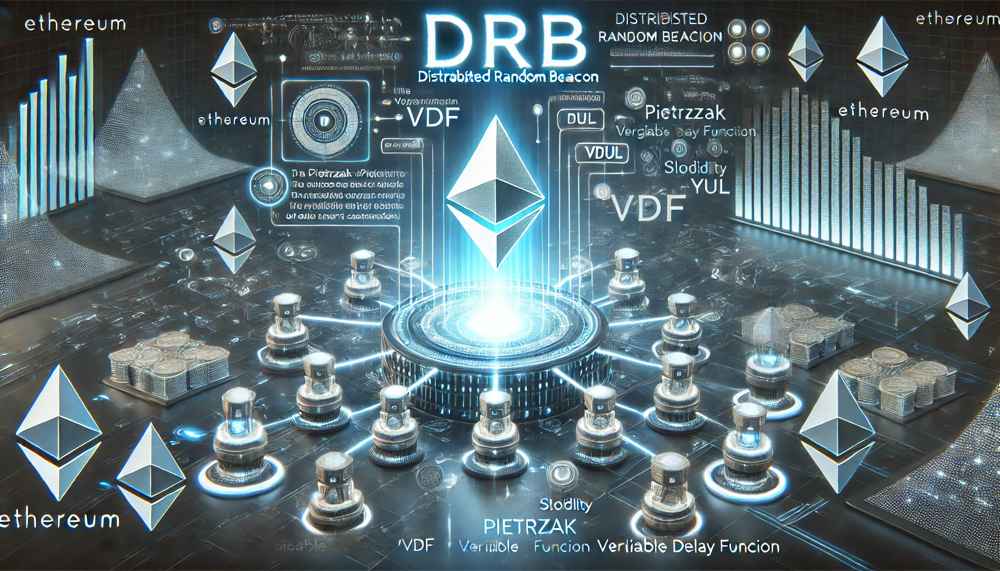
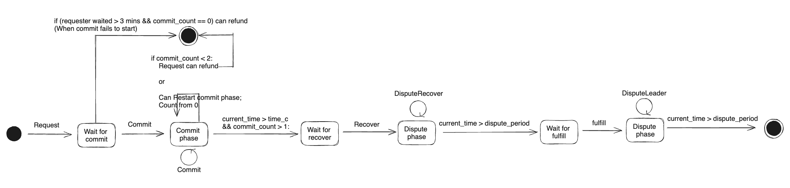

<p align="center">

<br/>

# Pietrzak-VDF-Verifier

Pietrzak VDF verifier implementation for EVM. The related technical details are presented in our preprint ([Arxiv](https://arxiv.org/abs/2405.06498)).

## State Diagram of Each Round of Proof of Fraud (will be updated)

<p align="center">

<br/>

- The next round can only be executed after the previous round has been recovered or refunded.
  
[Testnet deployment](https://www.notion.so/tokamak/Testnet-Contract-Addresses-c20b278f3514489ba767ab5d57149c1e)

- [Pietrzak-VDF-Verifier](#pietrzak-vdf-verifier)
  - [State Diagram of Each Round of Proof of Fraud (will be updated)](#state-diagram-of-each-round-of-proof-of-fraud-will-be-updated)
- [Getting Started](#getting-started)
  - [Requirements](#requirements)
  - [Quickstart](#quickstart)
  - [SET .env](#set-env)
- [Usage](#usage)
  - [Deploy](#deploy)
    - [EVM 'cancun' version (Local)](#evm-cancun-version-local)
    - [to network that supports 'cancun'](#to-network-that-supports-cancun)
    - [to Titan network](#to-titan-network)
  - [TEST](#test)
    - [hardhat](#hardhat)
    - [localhost](#localhost)
    - [test coverage](#test-coverage)
  - [VERIFY CODE](#verify-code)
  - [Static Analysis (will be updated)](#static-analysis-will-be-updated)
- [Details](#details)
  - [Roles in Coordinator](#roles-in-coordinator)
  - [Calculate Fees](#calculate-fees)
  - [Known Issues](#known-issues)
    - [For Operators](#for-operators)
    - [For Consumers](#for-consumers)

# Getting Started

## Requirements

- [git](https://git-scm.com/book/en/v2/Getting-Started-Installing-Git)
  - You'll know you did it right if you can run `git --version` and you see a response like `git version x.x.x`
- [Nodejs](https://nodejs.org/en/)
  - You'll know you've installed nodejs right if you can run:
    - `node --version` and get an output like: `vx.x.x`
    - It'll need to be at least `18.16.0` of node 
- [Yarn](https://yarnpkg.com/getting-started/install) instead of `npm`
  - You'll know you've installed yarn right if you can run:
    - `yarn --version` and get an output like: `x.x.x`
    - You might need to [install it with `npm`](https://classic.yarnpkg.com/lang/en/docs/install/) or `corepack`

## Quickstart
```
git clone https://github.com/tokamak-network/VDF-RNG-verifier.git
cd VDF-RNG-verifier
yarn
```
 
## SET .env
- Refer to .env.example to set up your .env file
- Get INFURA_API_KEY from [infura dashbord](https://app.infura.io/dashboard)
- Need two private keys to test the DRB by scripts.
- Get ETHERSCAN_API_KEY from [etherscan myapikey](https://etherscan.io/myapikey/)
- Get OP_ETHERSCAN_API_KEY from [opetherscan myapikey](https://optimistic.etherscan.io/myaccount)
- Get COINMARKETCAP_API_KEY from [coinmarketcap](https://pro.coinmarketcap.com/account/)

# Usage

## Deploy

### EVM 'cancun' version (Local)
```shell
npx hardhat node --no-deploy
#Started HTTP and WebSocket JSON-RPC server at http://127.0.0.1:8545/

npx hardhat deploy --network localhost --tags cancun --reset
```

### to network that supports 'cancun'
```shell
## CHANGE in hardhat.config.ts files at network :{} section
npx hardhat deploy --network <NETWORK_NAME> --tags cancun --reset
```

### to Titan network
```shell
npx hardhat deploy --network titan --tags paris --reset
```

## TEST

### hardhat
```shell
npx hardhat test
```

### localhost
```shell
#It runs test/CommitRevealRecoverRNG.test.ts
npx hardhat node
#Started HTTP and WebSocket JSON-RPC server at http://127.0.0.1:8545/
npx hardhat test --network localhost
```

### test coverage
```shell
npx hardhat coverage
```

## VERIFY CODE

- Guide(login required) : https://www.notion.so/onther/verify-contract-4b72acaa7e6c4dd0a8ee09fddfa6c539

## Static Analysis (will be updated)
```
slither .
```

# Details
- Solc Version: 0.8.24
- We are managing contracts by splitting evmVersion into **paris** and **cancun**.
  - cancun is for using transient storage.
  - paris is for network Titan network (legacy optimism fork).
- Chain(s) to deploy contract to: Ethereum, Sepolia, opSepolia, titan, titansepolia

## Roles in Coordinator
- **Owner**: The user who setSettingVariables
  - setting variables: disputePeriod, minimumDepositAmount, avgL2GasUsed, avgL1GasUsed, avgL1GasUsedForTitan, premiumPercentage, penaltyPercentage, flatFee
  - Decentralizing this Owner is not yet in the scope of this project.

## Calculate Fees
1. **DirectFundingPrice**
   - The cost of requesting a random number is calculated based on the optimistic case.
     - **Optimistic case of one round:**
       - 3 commits, 1 recover, 1 fulfill transaction fees.
     - Calculation formula:
       - `((tx.gasPrice * (callbackGasLimit + avgL2GasUsed)) * (premiumPercentage + 100)) / 100) + flatFee + getCurrentTxL1GasFee()`
       - Definitions:
         - `tx.gasPrice`: Gas price when the current transaction is executed.
         - `callbackGasLimit`: Gas limit of the `fulfillRandomWord` function set by the Consumer. When the Coordinator contract calls the `fulfillRandomWord` function of the Consumer contract, if the gas usage exceeds the `callbackGasLimit`, the random number is stored in the Coordinator contract only, and the random number to the Consumer contract is canceled. (The transaction does not revert).
         - `avgL2GasUsed`: Commit 3 average gas used + recover 1 average gas used + fulfillRandomWord 1 average gas used.
         - `premiumPercentage`: The cost can be multiplied by a percentage to increase the cost. It is currently set to 0 and not used.
         - `flatFee`: Flat fee.
         - `getCurrentTxL1GasFee()`: For L2, we need to calculate L1 gas.

   - **CurrentTxL1GasFee**
     - For L2, the size of the calldata determines the L1 gas cost, and different Optimism versions calculate the L1 gas cost differently. (Arbitrum is not considered.)
       - **Legacy versions (Titan, Titan Sepolia)**
         - In the Predeploy contract, the `OVM_GasPriceOracle` contract, values like `baseFee` are taken from the `OVM_GasPriceOracle` contract and calculated based on `calldata_size`.
         - Fixed address of `OVM_GasPriceOracle` contract: `0x420000000000000000000000000000000000000000000000000F`
       - **Bedrock version, Ecotone version**
         - Both Bedrock and Ecotone versions get `baseFee` and blob-related values from a predeploy contract called `L1_Block_Attributes` and calculate them based on `calldata_size`.
         - `L1_Block_Attributes` contract at fixed address: `0x4200000000000000000000000000000000000000000000000015`

   - **CalculateDirectFundingPrice example on Titan network**
     - `tx.gasPrice`: Fixed to 0.001 Gwei.
     - `callbackGasLimit`: Assumed to be 100,000.
     - `avgL2GasUsed`:
       - 3 Commit: 554690 + 539184 + 558154 = 1,652,028
       - 1 Recover: 337,913
       - 1 FulfillRandomWord: Approx. 118,000
       - Total: 2,107,941
     - `flatFee`: Assumed to be 0.001 ETH.
     - `getCurrentTxL1GasFee()`:
       - `avgL1GasUsed` (proportional to calldata size):
         - 3 Commit: 10,508 + 10,496 + 10,496
         - 1 Recover: 10,484
         - 1 FulfillRandomWord: 5,840
         - Total: 47,824
       - `l1BaseFee`: 23.433261599 Gwei (fixed).
     - Calculation:
       - `0.001 Gwei * (100,000 + 2,107,941) + 0.001 ETH + 23.433261599 Gwei * 47,824`
       - `= 2,207,941,000,000 + 1,000,000,000,000,000 + 1,120,672,302,710,576 wei`
       - `= 2,122,880,243,710,576 wei`
       - `=> 0.002122880243710576 ETH`
       - `=> 11,003 KRW`
       - `=> 8.03 USD`

2. **EstimateDirectFundingPrice**
   - How to calculate how much to send when requesting a `requestRandomWord` off-chain:
     1. Get the `gasPrice` of the current network.
     2. Use the `EstimateDirectFundingPrice` view function of the Coordinator contract to get the corresponding cost by providing the `gasPrice` and `callbackGasLimit` as parameters.
     3. Add a buffer to the cost and include it as a value when calling `requestRandomWord`.
        - Reason for buffer: The `gasPrice` can fluctuate (the `gasPrice` obtained off-chain and the `gasPrice` when the transaction is executed can be very different).
        - A buffer of 10% is a good rule of thumb.
        - What happens to the amount left over after giving a buffer?
          - The remaining amount will stay in the Consumer contract. In a single transaction of `requestRandomWord`, the `calculateDirectFundingPrice` function is executed twice (once by the Consumer and once by the Coordinator).
            - We should provide guidance for Consumer contract developers to implement logic that allows the requestor to withdraw the remaining amount, or handle it differently.
              - When implementing the Consumer, we will guide developers to implement it by inheriting from an abstract contract called `RNGConsumerBase`. By declaring an empty function to handle the remaining amount, Consumer developers will be required to implement it to avoid abstract contract errors.


## Known Issues

### For Operators

1. **minimumDepositAmount**
   - Since the rounds run in some degree of parallel, it is possible to be penalized simultaneously at a given point. Therefore, logic needs to be added to check if the minimumDepositAmount of the operators is appropriate for each round.
     - This will be fixed after the RandomDay event.
   - Incentive mechanisms (not updated yet):
     - What if the leader doesn't recover for 2 minutes?
       - Any other operators who committed to this round should recover.
       - There should be a recovery gas cost plus some reward. The leader's reward goes to the recoverer (first come, first served).

2. **reRequestRandomWordAtRound**
   - The function may be executed when the commitPhase is over and there are less than 2 commits.
   - In a round that is reRequested when there is already a single commit, the existing committed commit and its operator are expected to participate normally in that round. However, the existing commit count is ignored and counted from zero again.
     - Reason: We implemented this because if the reRequested round creates one more commit, resulting in a total of two commits to recover, it may not be a safe random number.
   - Who runs it?
     - Functions can be executed by anyone, but the operator (who wants to participate in the round) will be the one to run it.
     - But who would want to sacrifice gas to participate? This issue is not yet solved (only the function is implemented).

### For Consumers

1. **refundAtRound**
   - The function may be executed when the commitPhase is over and there are less than 2 commits. 
   - Or, 3 minutes have passed and no one has committed.
